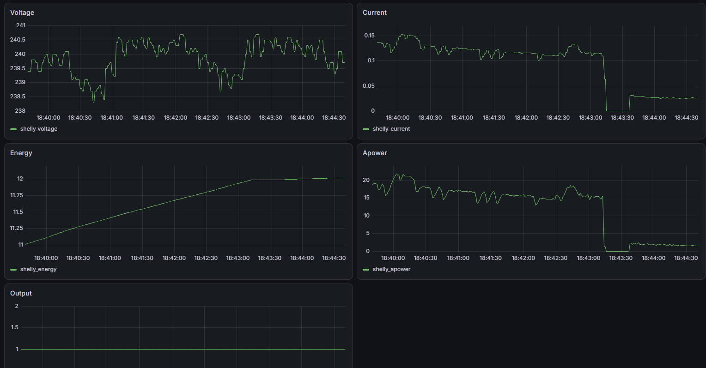

# Code for my Leaving Cert Physics project
### "Energy efficiency in household enviornment"

shelly portal: http://192.168.33.1/#/

[shellydoc.md](shellydoc.md) 

output example:
```json lines
{"timestamp":"2026-09-21T20:03:07.5569127+01:00","id":0,"source":"WS_in","output":false,"apower":0,"voltage":241.9,"current":0,"aenergy":{"total":0.007},"temperature":{"tC":36.3,"tF":97.3}}
{"timestamp":"2026-09-21T20:03:08.5357834+01:00","id":0,"source":"WS_in","output":false,"apower":0,"voltage":241.8,"current":0,"aenergy":{"total":0.007},"temperature":{"tC":36.3,"tF":97.3}}
{"timestamp":"2026-09-21T20:03:09.5378793+01:00","id":0,"source":"WS_in","output":false,"apower":0,"voltage":241.8,"current":0,"aenergy":{"total":0.007},"temperature":{"tC":36.3,"tF":97.3}}
{"timestamp":"2026-09-21T20:03:10.5362428+01:00","id":0,"source":"WS_in","output":false,"apower":0,"voltage":241.9,"current":0,"aenergy":{"total":0.007},"temperature":{"tC":36.3,"tF":97.3}}
{"timestamp":"2026-09-21T20:03:11.5396181+01:00","id":0,"source":"WS_in","output":true,"apower":0,"voltage":241.9,"current":0,"aenergy":{"total":0.007},"temperature":{"tC":36.3,"tF":97.3}}
{"timestamp":"2026-09-21T20:03:12.5366922+01:00","id":0,"source":"WS_in","output":true,"apower":0,"voltage":241.8,"current":0,"aenergy":{"total":0.007},"temperature":{"tC":36.3,"tF":97.3}}
{"timestamp":"2026-09-21T20:03:13.5398091+01:00","id":0,"source":"WS_in","output":true,"apower":0,"voltage":241.8,"current":0,"aenergy":{"total":0.007},"temperature":{"tC":36.1,"tF":97}}
{"timestamp":"2026-09-21T20:03:14.535888+01:00","id":0,"source":"WS_in","output":true,"apower":0,"voltage":241.8,"current":0,"aenergy":{"total":0.007},"temperature":{"tC":36.3,"tF":97.3}}
{"timestamp":"2026-09-21T20:03:15.5415833+01:00","id":0,"source":"WS_in","output":true,"apower":0.1,"voltage":241.8,"current":0.029,"aenergy":{"total":0.007},"temperature":{"tC":36.1,"tF":96.9}}
{"timestamp":"2026-09-21T20:03:16.537862+01:00","id":0,"source":"WS_in","output":true,"apower":4.1,"voltage":241.8,"current":0.029,"aenergy":{"total":0.008},"temperature":{"tC":35.8,"tF":96.5}}
{"timestamp":"2026-09-21T20:03:17.5414469+01:00","id":0,"source":"WS_in","output":true,"apower":4.2,"voltage":241.8,"current":0.035,"aenergy":{"total":0.009},"temperature":{"tC":36.2,"tF":97.1}}
{"timestamp":"2026-09-21T20:03:18.5401197+01:00","id":0,"source":"WS_in","output":true,"apower":3.9,"voltage":243.1,"current":0.035,"aenergy":{"total":0.01},"temperature":{"tC":36.2,"tF":97.2}}
{"timestamp":"2026-09-21T20:03:19.538948+01:00","id":0,"source":"WS_in","output":true,"apower":4.1,"voltage":243.1,"current":0.035,"aenergy":{"total":0.012},"temperature":{"tC":36.2,"tF":97.2}}
{"timestamp":"2026-09-21T20:03:20.5397905+01:00","id":0,"source":"WS_in","output":true,"apower":4,"voltage":243.4,"current":0.035,"aenergy":{"total":0.013},"temperature":{"tC":36.3,"tF":97.3}}
{"timestamp":"2026-09-21T20:03:21.5363469+01:00","id":0,"source":"WS_in","output":true,"apower":4.3,"voltage":243.4,"current":0.034,"aenergy":{"total":0.014},"temperature":{"tC":36.2,"tF":97.2}}
{"timestamp":"2026-09-21T20:03:22.536207+01:00","id":0,"source":"WS_in","output":true,"apower":4,"voltage":243.5,"current":0.034,"aenergy":{"total":0.015},"temperature":{"tC":36.3,"tF":97.3}}
{"timestamp":"2026-09-21T20:03:23.5369585+01:00","id":0,"source":"WS_in","output":true,"apower":3.9,"voltage":243.5,"current":0.018,"aenergy":{"total":0.016},"temperature":{"tC":36.1,"tF":96.9}}
{"timestamp":"2026-09-21T20:03:24.5426333+01:00","id":0,"source":"WS_in","output":true,"apower":3.9,"voltage":243.5,"current":0.018,"aenergy":{"total":0.016},"temperature":{"tC":36.2,"tF":97.1}}
{"timestamp":"2026-09-21T20:03:25.5372795+01:00","id":0,"source":"WS_in","output":true,"apower":0,"voltage":243.5,"current":0,"aenergy":{"total":0.016},"temperature":{"tC":36.2,"tF":97.1}}
{"timestamp":"2026-09-21T20:03:26.5386664+01:00","id":0,"source":"WS_in","output":true,"apower":0,"voltage":243.4,"current":0,"aenergy":{"total":0.016},"temperature":{"tC":36.2,"tF":97.1}}
{"timestamp":"2026-09-21T20:03:27.5356859+01:00","id":0,"source":"WS_in","output":true,"apower":0,"voltage":243.4,"current":0,"aenergy":{"total":0.016},"temperature":{"tC":36.2,"tF":97.1}}

```
# Explained
- **voltage** - RMS voltage, volts
- **current** - RMS current, amps
- **apower** - active power in watts. (the actual number that means something)
- **aenergy.total** - cumulative energy
- **output** - relay status
- **temperature** - temperature of the plug
- **id** - channel number. zero here because there is one plug
- **source** - what last changed the relay: `WS_in` means the web UI, `init` is plug auto on, on plug-in. or can be `button` for the button on the switch


# Instructions:
1. Install latest binary from [releases](https://github.com/Mistromy/fridgePhysProject/releases)  
    - in releases fine latest tag
    - click on assets
    - download the .exe file. likely `meter.exe`
2. Connect your device to the Shelly Plug's network
    - make sure the shelly is plugged in, and in your device's wifi settings find a wifi called ShellyPlusPlugUK and connect
3. Run the .exe file. Windows will show a popup saying the program is untrusted. click i know what im doing / read more and click run anyways
4. the program will start printing info to the terminal while simultaneously saving the data to a file next to the .exe

# Live Display:
graphana showing data from victoriametrics


grafana on port `3000`<br>victoriametrics on port `8428`

[VictoriaMetrics Download](https://github.com/VictoriaMetrics/VictoriaMetrics/releases/download/v1.152.0/victoria-metrics-windows-amd64-v1.152.0.zip)
<br>
[Grafana Download](https://dl.grafana.com/grafana-enterprise/release/13.2.2/grafana-enterprise_13.2.2_34846740809_windows_amd64.tar.gz)